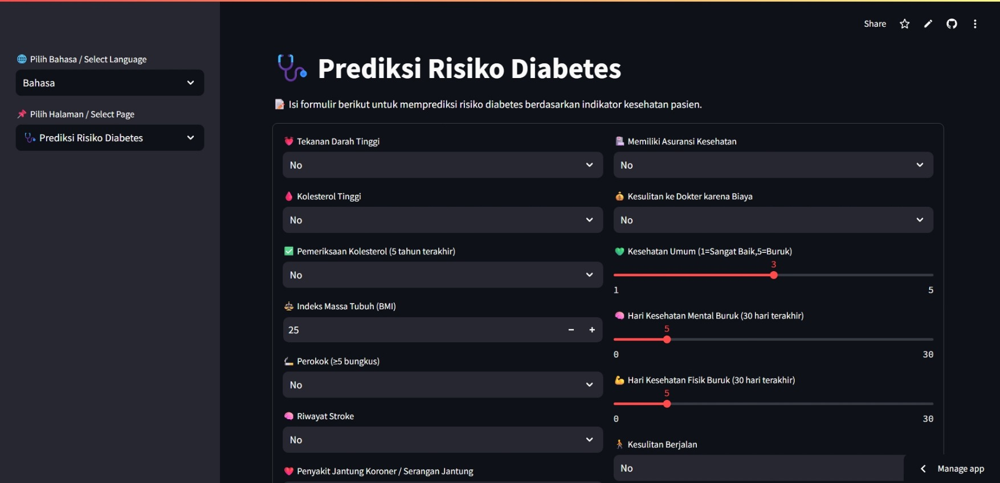
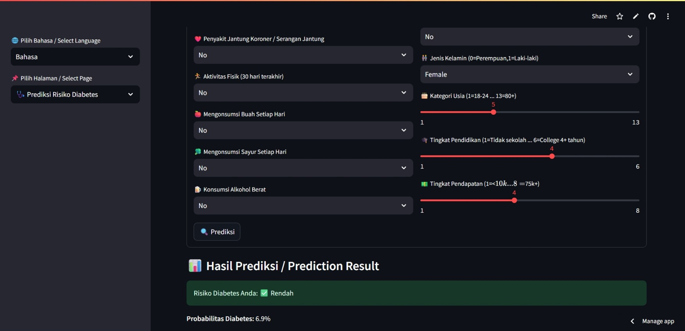
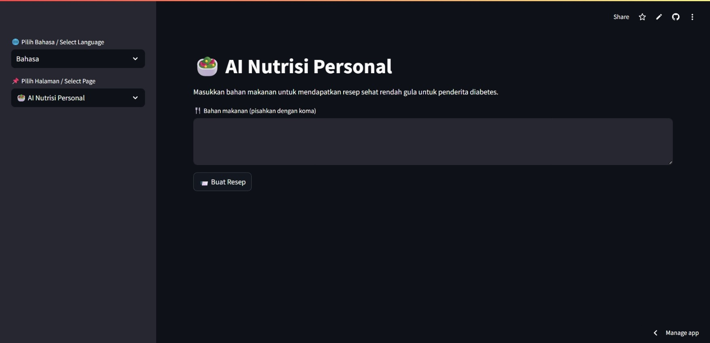
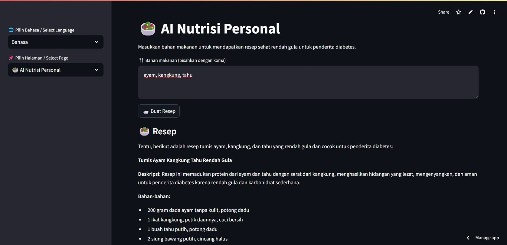
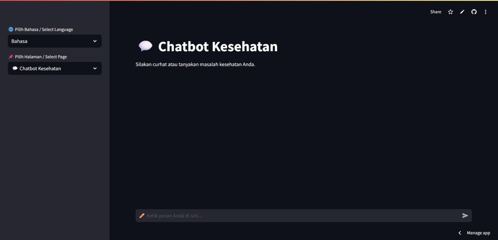
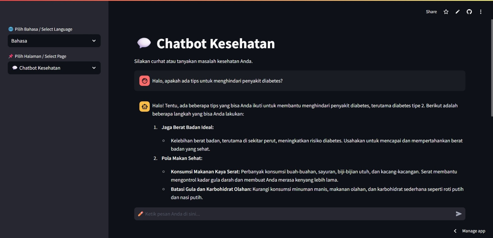
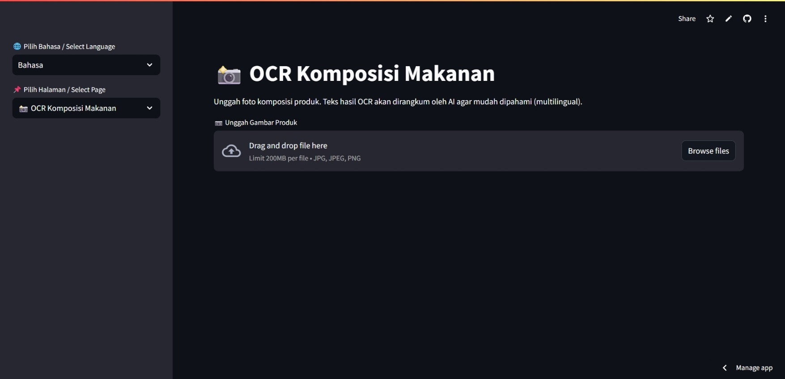
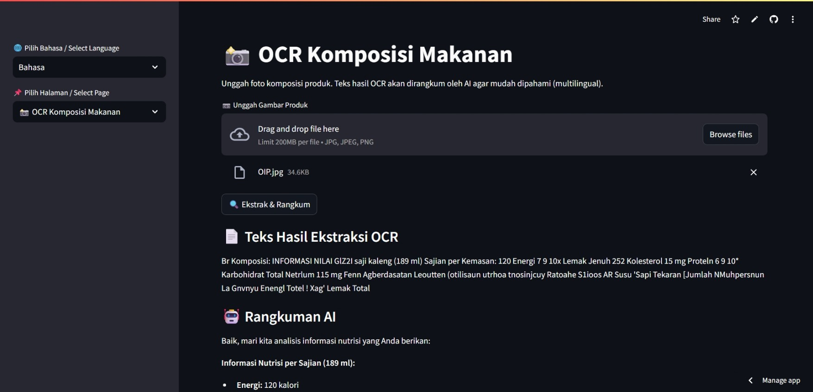

# DiabetMate: Pendamping Diabetes Pribadi Berbasis AI

Repositori ini berisi kode sumber untuk **DiabetMate**, sebuah aplikasi web komprehensif berbasis AI yang dirancang untuk memberdayakan masyarakat Indonesia dalam mengelola dan mencegah diabetes secara proaktif.

[🔗 Lihat Repositori GitHub](https://github.com/bagusangkasawan/DiabetMate-Prototype)

---

## Daftar Isi
- [Tentang Proyek](#tentang-proyek)  
- [Fitur Utama](#fitur-utama)  
- [Tampilan Aplikasi](#tampilan-aplikasi)  
- [Teknologi yang Digunakan](#teknologi-yang-digunakan)  
- [Cara Menggunakan](#cara-menggunakan)  
- [Struktur Folder](#struktur-folder)  
- [Tim Kami](#tim-kami)  

---

## Tentang Proyek
**DiabetMate** adalah "pendamping kesehatan digital" yang bertujuan mengatasi krisis kesehatan masyarakat terkait diabetes di Indonesia. Dengan jutaan kasus yang tidak terdiagnosis, aplikasi ini hadir untuk menjembatani kesenjangan akses terhadap informasi kesehatan yang dipersonalisasi dan relevan secara budaya. DiabetMate mengintegrasikan beberapa fitur berbasis AI untuk memberikan dukungan holistik dan berkelanjutan bagi para penggunanya.

---

## Fitur Utama
Aplikasi ini dilengkapi dengan empat fitur unggulan:

- 🩺 **Prediksi Risiko Diabetes Berbasis Bukti**  
  Menganalisis 21 indikator kesehatan dan demografis untuk memberikan skor risiko (rendah, sedang, tinggi) secara instan, mendorong kesadaran dini dan pencegahan.

- 🥗 **AI Nutrisi Personal Sadar Budaya**  
  Memberikan resep masakan sehat rendah glikemik berdasarkan bahan-bahan lokal Indonesia yang dimasukkan oleh pengguna, memastikan diet sehat tetap praktis dan sesuai selera.

- 💬 **Chatbot Kesehatan Interaktif & Empatik**  
  Beroperasi 24/7 sebagai sumber dukungan rahasia untuk menjawab pertanyaan seputar diabetes dan memberikan dukungan emosional bagi pengguna.

- 📸 **OCR Komposisi Makanan**  
  Memindai gambar komposisi produk makanan, mengekstrak teksnya, dan menyajikannya dalam bentuk rangkuman AI yang mudah dipahami, lengkap dengan analisis keamanan untuk penderita diabetes.

---

## Tampilan Aplikasi
Berikut adalah beberapa cuplikan layar dari aplikasi kami:

- **Halaman Prediksi Risiko** 

  

  

- **AI Nutrisi Personal**  

  

  

- **Chatbot Kesehatan**  

  

  

- **OCR Komposisi Makanan**  

  

  

---

## Teknologi yang Digunakan
**Prototipe:**
- Framework: Python, Streamlit
- Machine Learning: Scikit-learn, Joblib
- Generative AI & NLP: Google Gemini API
- OCR: EasyOCR
- Data Handling: Pandas

**Versi Produksi (Rencana):**
- Frontend: React.js
- Backend (API Gateway): Node.js, Express.js
- Backend (AI/ML Service): Flask, Docker
- Database: MongoDB Atlas

---

## Cara Menggunakan
Aplikasi ini tidak memerlukan instalasi lokal. Anda bisa langsung mengakses prototipe melalui tautan berikut:

- [Akses Prototipe Utama (Streamlit)](https://diabetmate-prototype.streamlit.app)  
- [Akses Prototipe Cadangan (Hugging Face)](https://huggingface.co/spaces/bagusasp/diabetmate-prototype)

### Panduan Fitur
1. **Mengecek Risiko Diabetes**
   - Buka aplikasi dan pilih halaman "Prediksi Risiko Diabetes".
   - Isi formulir dengan 21 indikator kesehatan secara lengkap.
   - Klik tombol **Prediksi** untuk melihat hasil risiko.

2. **Mendapatkan Resep Sehat dari AI**
   - Pilih halaman "AI Nutrisi Personal".
   - Masukkan bahan-bahan masakan yang tersedia.
   - Klik **Buat Resep**, tunggu, dan lihat resep sehat yang dihasilkan.

3. **Berkonsultasi dengan Chatbot Kesehatan**
   - Pilih halaman "Chatbot Kesehatan".
   - Ketik pertanyaan atau keluhan pada kolom chat.
   - Tekan Enter atau klik kirim untuk mendapatkan respons AI.

4. **Menganalisis Komposisi Makanan dengan OCR**
   - Pilih halaman "OCR Komposisi Makanan".
   - Unggah foto komposisi produk makanan.
   - Klik **Ekstrak & Rangkum** untuk melihat analisis keamanan bagi penderita diabetes.

---

## Struktur Folder
```

/
├── .streamlit/
│   └── secrets.toml          # File untuk menyimpan kunci API
├── app.py                    # Kode utama aplikasi Streamlit
├── diabetes_health_indicators_classifier_v1.joblib # Model Machine Learning
├── requirements.txt          # Daftar dependensi Python
└── README.md

```

---

## Tim Kami
**MateGroup**
- Bagus Angkasawan Sumantri Putra - Application Developer & AI Engineer  
- Sayyidah Hikma Lutfiyana - UI/UX & Frontend Developer  
- Selly Putriliana - Medical Laboratory Technologist & Health Reviewer  

Tautan Proyek: [https://github.com/bagusangkasawan/DiabetMate-Prototype](https://github.com/bagusangkasawan/DiabetMate-Prototype)  

Dibuat dengan ❤️ oleh Tim MateGroup untuk **Indonesia Healthcare AI Hackathon 2025**.
